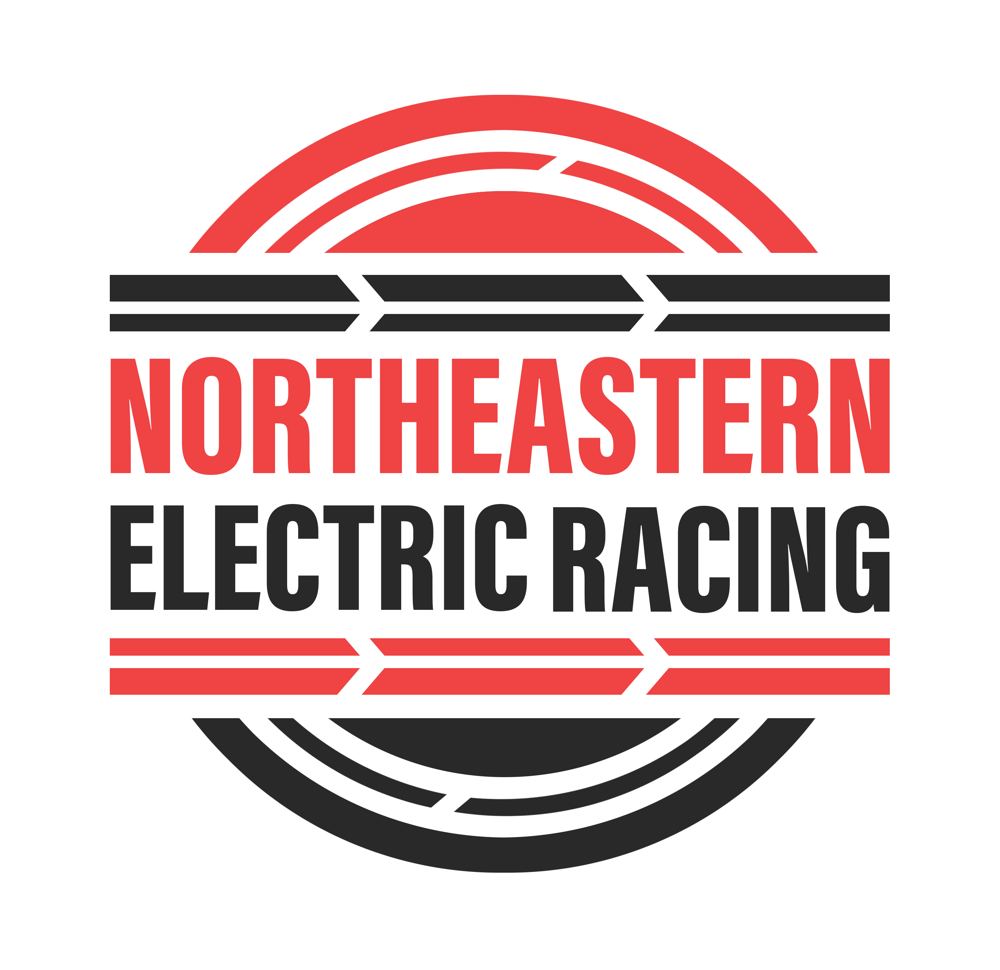
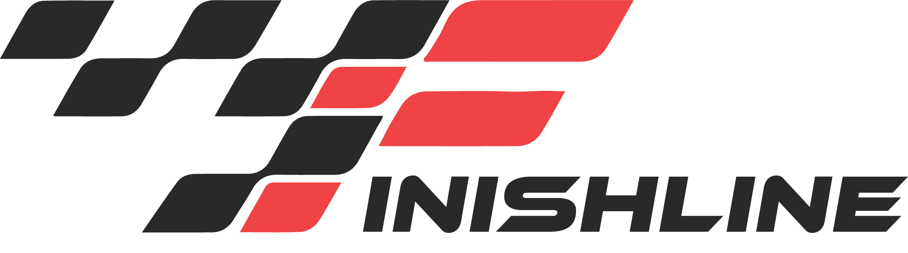

<a href="https://electricracing.northeastern.edu">
<picture>
  <source media="(prefers-color-scheme: dark)" srcset="https://electricracing.northeastern.edu/wp-content/uploads/2023/02/cropped-NER-logo-white.png" width="200">
  
</picture>
 </a>

&nbsp&nbsp

<a href="https://finishlinebyner.com"> <picture>
  <source media="(prefers-color-scheme: dark)" srcset="../assets/FinishlineDark.jpg" width="20" height="20">
  
</picture> </a> &nbsp&nbsp 
&nbsp&nbsp  &nbsp&nbsp

&nbsp

  

&nbsp

We are a student-run organization at Northeastern University building all-electric formula-style race cars from scratch to compete in Formula Hybrid + Electric and Formula SAE.

Our software team is a diverse group of software, computer, and electrical engineers committed to developing quality products and applications. The scope of the software team ranges from writing the code for real-time firmware control of critical automotive systems to developing a fully featured project management dashboard to maintain the timeline and organization required for building a racecar annually.

## Our Active Projects

| Project Name | Description | Technologies Used |
| ------------ | :---------: | ---------------------------- |
| | **Web Development** | |
| <a href="https://github.com/Northeastern-Electric-Racing/FinishLine"> <picture> <source media="(prefers-color-scheme: dark)" srcset="../assets/FinishlineDark.jpg" width="80" height="60">  </picture> </a>    | A full-stack web application which enables organized project management of the team's build cycle, including timeline, task, personnel, BOM, finance, and meeting management. | Typescript, React, Express, Node.js |
| [Launchpad](https://github.com/Northeastern-Electric-Racing-Launchpad) (external org) | A git based educational system for understanding and honing basic skills in the world of software. | Git, Typescript, React, Express |
| | **Application Software** | |
| [Argos](https://github.com/Northeastern-Electric-Racing/Argos) | A full stack data visualization and storage tool enabling real-time processing of car diagnostics for debugging and racetime information, as well as long term cloud management and querying of car statitistics. | Rust, MQTT, Prisma, TimescaleDB, Angular, Typescript, Protobuf |
| [Nero](https://github.com/Northeastern-Electric-Racing/Nero-2.0) | An extensive and intuitive car dashboard. | QT, C++, QML, MQTT |
| | **Firmware** | |
| [Shepherd](https://github.com/Northeastern-Electric-Racing/ShepherdBMS-2)  | A from-scratch battery management system.  | C |
| [Cerberus](https://github.com/Northeastern-Electric-Racing/Cerberus)     | A real-time state manager for the car, controlling torque calculations and peripheral functions. | C, FreeRTOS |
| [Proteus](https://github.com/Northeastern-Electric-Racing/ProteusMC) | A real-time from-scratch dual processor motor controller (pre 1.0). | C, FreeRTOS |
| [Mechanical Sensor Board FW ](https://github.com/Northeastern-Electric-Racing/MSB-FW) | A minimal and dynamic sensor interpreter for CAN bus relaying (pre 1.0). | C, FreeRTOS |
| | **Embedded Software** | |
| [Odysseus](https://github.com/Northeastern-Electric-Racing/Odysseus)  | A custom Linux operating system supporting our Wireless and Siren initiatives, also hosting Calypso, NERO, and Argos. | HaLow 802.11ah, MQTT, Buildroot, Python |
| [Calypso](https://github.com/Northeastern-Electric-Racing/Calypso) | A minimal application to bidirectionally process and translate CAN bus packets and MQTT messages using a human readable code-generating configuration. | Rust, SocketCAN, MQTT, Python, Protobuf |
| | | |
| [Embedded-Base](https://github.com/Northeastern-Electric-Racing/Embedded-Base) | A collection of platform agnostic drivers, middlewares, and CAN bus decoder/encoder generation utilities to support firmware and embedded software projects. | C, Python |

  

If you have any questions or would like to get involved in the NER Software Team, please reach out to Chief Software Engineer Peyton McKee: mckee.p@northeastern.edu.

